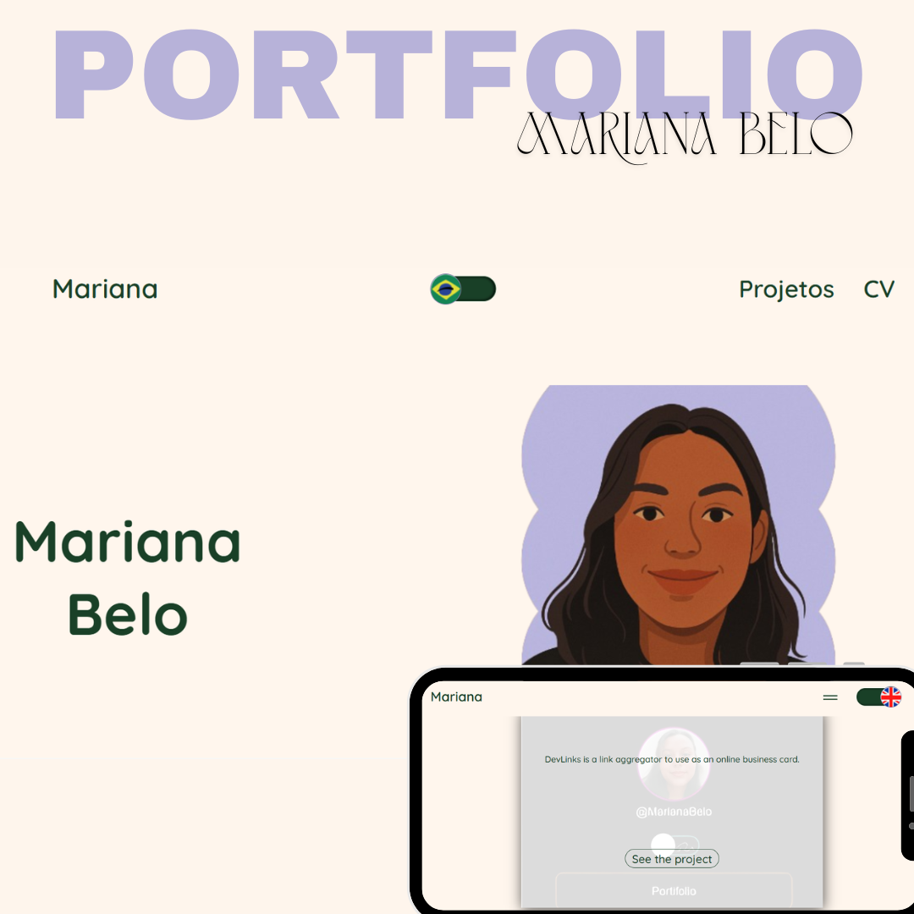

<h1 align="center">🌐 Mariana Belo – Portfolio</h1>

## 📲 Acesse / Access

**Contatos / Contacts:**

- [LinkedIn](https://linkedin.com/in/marianabelo26/)
- [Instagram](https://instagram.com/marianabelo.__)
- [Portfólio Web (live)](https://marianabelo.netlify.app/)

---

## 💻 Projeto / Project

### 🖥️ [Portfolio Website](https://marianabelo.netlify.app/)

  

Este é meu portfólio profissional, desenvolvido para apresentar meus projetos e facilitar o contato com recrutadores e colaboradores.

This is my professional portfolio, created to showcase my projects and make it easier for recruiters and collaborators to reach out.

---

## 🚀 Tecnologias / Tech Stack

- HTML5
- CSS3
- React
- JavaScript
- Git & GitHub
- Netlify (Deploy)

---

## 📷 Preview

  

---

## 🤝 Conecte-se / Let's connect!

Sinta-se à vontade para me chamar em qualquer rede para conversarmos sobre projetos, freelas ou oportunidades de trabalho.

Feel free to reach out to me on any platform to talk about projects, freelancing, or job opportunities.

---

## 🪪 Autor / Author

**Mariana Belo**  
🌍 Front-end Developer  
📍 Teixeira de Freitas, BA – Brazil  
📧 mariana.belo26@hotmail.com

---
